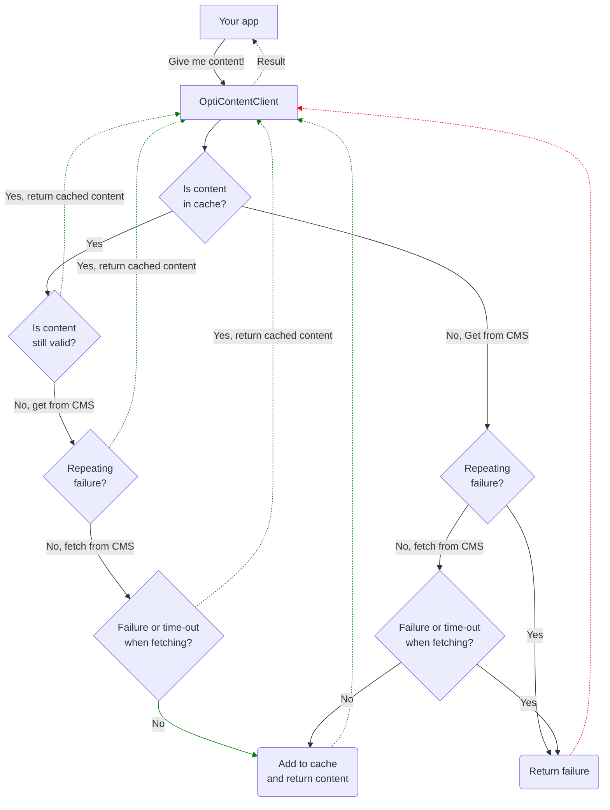

# OptiContentClient

A .Net API client for Optimizely Content delivery API, with a focus on resilience and performance.<br>
Makes it simple to fetch content and map the content to your strongly types models. It can be used in a "headless" solution that fetch content from Optimizely CMS. For example an externally hosted Blazor web app. 

### Key features
* Fetch content by url or content identifier (Id or GUID), get children or anscestors. Matches the [endpoints in Content API v3](https://docs.developers.optimizely.com/content-management-system/v1.5.0-content-delivery-api/reference/content_getbycontentidentifier)
* Easily map your view models with the CMS content models by using a class attribute.
* Makes sure content is always returned quickly. If expired content can't be refreshed within x milliseconds, the expired content is returned.
* You manage where you want the content to be cached by implementing IContentCache.
* Implements a simple [cuircuit breaker](https://en.wikipedia.org/wiki/Circuit_breaker_design_pattern), so that the CMS is not hammered with requests if repeating errors occurs.
* Works when doing on-page editing in Optimizely CMS. 
  
### How to use
* Enable Content Delivery API on your Optimizely CMS.
* Add OptiContentClient nuget to your delivery web app.
* Add viewmodels in your delivery app that map your CMS content models.
* Implement IContentCache to enable caching of content.
* Start fetching content!


**NOTE: this library is work in progress, it has not been properly tested and is lacking some features.<br>
It will be production ready before end of 2023.**

## Enable Content Delivery API in you CMS app
Add [EPiServer.ContentDeliveryApi.Cms](https://docs.developers.optimizely.com/content-management-system/v1.5.0-content-delivery-api/docs/quick-start), and add configuration in ConfigureServices in Startup.cs:
```csharp
services.AddContentDeliveryApi(options =>
{
}).WithFriendlyUrl();

services.Configure<EPiServer.ContentApi.Core.Configuration.ContentApiOptions>(options =>
{
    options.FlattenPropertyModel = false; // Must be false for OptiContent to work
    options.IncludeEmptyContentProperties = false;
    options.IncludeMasterLanguage = false;
    options.ExpandedBehavior = ExpandedLanguageBehavior.RequestedLanguage;
});
```

<br>

## Set up the delivery app
Add OptiContentClient nuget to your delivery app, and add the url to your CMS in your configuration (appsettings.json):
```json
{
  "CmsApiBaseUri": "https://mycmsurl.com"
}
```
Configure OptiContent service in Program.cs:
```csharp
//optional, but highly recommended to implement IContentCache  
builder.Services.AddSingleton<IContentCache, MemoryContentCache>(); 

builder.Services.AddOptiContentService(new ContentClientOptions
{
    BaseUrl = builder.Configuration["CmsApiBaseUri"] ?? throw new ConfigurationErrorsException("Missing CmsApiBaseUri in configuration.")
});
```
#### ContentClientOptions
* BaseUrl - Url to CMS
* CacheSoftTtlSeconds - Content will be considered expired after this, and new content will be fetched from CMS.
* CacheHardTtlSeconds - How long the content will be stored in the cache (expired or not).
* TimeoutMilliseconds - Number of milliseconds to wait when fetching content from CMS.
* FailedFetchLimit - Will not try to make any more requests to the CMS if there are repeating failures during a short period.


### View models
You define your view models and connect them to the CMS content model with a class attribute.
These are the view models that you will use on your Page components.<br/>
Example models:
```csharp
public class MyBasePage : Content
{
    public PropertyString MetaTitle { get; set; }
    public PropertyString MetaDescription { get; set; }
}

[CmsContentType("StandardPage")] //this connects your view model with the CMS page type called "StandardPage"
public class MyStandardPage : MyBasePage
{
    public PropertyString MainBody { get; set; }
    public PropertyString TestString { get; set; }
    public PropertyContentArea MainContentArea { get; set; }
}
```
<br>

## Fetch content
ContentService returns a ContentContainer object that holds some meta data and typed content items. 
````csharp
//_contentService = OptiContentClient.Services.ContentService

var contentContainer = await _contentService.GetContentByPath(pathAndQuery);

// "105" = page id (could also be page guid), "sv" = language.
var childrenArray = (await contentService.GetChildren("105","sv")).Content 
````
<br>

## Caching

Fetched content can be cached, the cache has two expiration times; a "soft time to live", and a "hard time to live". Soft TTL is when content is considered expired, and new content will be fetched from CMS. Hard TTL is how long the content will be stored in the cache (expired or not). This means that even if new content can't be fetched from CMS for some reason, the content from the cache will be returned.<br>
Once content have been stored in the cache you could switch off the CMS and your delivery web app would continue to work.  

Out of the box OptiContent doesn't cache the content fetched from the CMS. But it's higly recommended to have some sort of caching by implementing IContentCache. Here is an example of how that can be done using the regular .Net MemoryCache. <br>
For a truly resilient content cache you should also use a persistent cache, like Redis.
```csharp
using Microsoft.Extensions.Caching.Memory;
using OptiContentClient;
using OptiContentClient.Models;

public class MemoryContentCache : IContentCache
{
    private readonly IMemoryCache _memoryCache;

    public MemoryContentCache(IMemoryCache memoryCache)
    {
        _memoryCache = memoryCache;
    }

    public ContentContainer? Get(string key)
    {
        return _memoryCache.TryGetValue(key, out ContentContainer? contentContainer) ? contentContainer : null;
    }

    public void Set(string key, ContentContainer contentContainer, TimeSpan expiresAfter)
    {
        _memoryCache.Set(key, contentContainer, expiresAfter);
    }
}                           
```
<br>

## Detailed flow when fetching content


